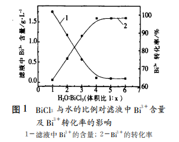
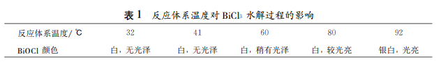
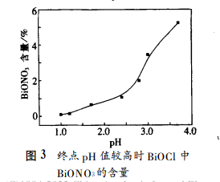
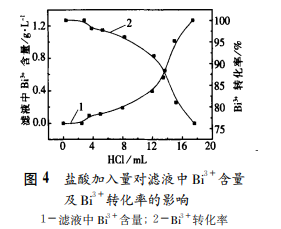

# BioCl Hydrolysis Method Information Summary

## Literature report information summary

### Chinese literature

#### Chinese paper

##### 硝酸铋转化水解法制备片状 BiOCl 粉末的研究 (王云燕，彭文杰 ;中南大学冶金科学与工程学院，湖南 长沙)

###### 摘 要

​	对硝酸铋转化水解法制备 BiOCl 粉末进行了详细的研究，大量探索实验发现反应过程中稀释 水的量、 温度和终点 pH 值对水解过程有较大的影响。 实验结果表明： 控制 BiCl3（0.3675mol·L －1） 与 稀释水的比例为1∶4，反应温度为90～95℃，终点 pH 值为1～2的条件下可以制得粒度约为5～10μm 的珠光片状 BiOCl 晶体，可广泛应用作涂料、医药和化妆品方面的增白收敛剂、精细陶瓷的原料等领域。 

###### 线索文献（即：本文参考文献中的有用线索）

2：Botar Alexandru， Paul Viorica， Patrut Adrian. Preparation of Bismuth Oxychlorido －titania Based Pearly Pigments for Glassw ork Articles

氧氯化铋-二氧化钛基玻璃制品珠光颜料的制备

12：郑国渠，唐谟堂 .BiCl3－HCl－H2O 系蒸发过程馏 余物物相研究 ［J］ .中国有色金属学报

13：郑国渠，曹华珍，唐谟堂 .氯氧铋制备高纯氧化铋过 程中除氯的研究 ［J］ .有色金属，

14：Allen J Bard，Roger Parsons，Joseph Jordan . Standard Potentials in Aqueous Solution

艾伦 · J · 巴德，罗杰 · 帕森斯，约瑟夫 · 乔丹。标准潜力水溶液

4：Belskij Arkadij A ， Veviorshij Anri P， Konstantinova Lyubov I，et al.M ethod of Producing Bismuth Oxychloride Base M other － of － pearl Pigment

珍珠色素氯氧化铋基母的制备方法

5：Gimenez Francisco M alaga.Bismuth Oxychloride Formulation and Its Use in Obtaining M etallic Iridescent or M ulticolor Risual Effecs on Plastic Films and Laminates

氯氧化铋配方及其在获得塑料薄膜和层压板金属色彩或多色增强效应中的应用

###### 反应原理

硝酸铋转化水解法制备 BiOCl 的原理基于 下列反应：

转化 Bi（ NO3）3＋3NaCl＝BiCl3＋3NaNO3 

水解 Bi 3+＋Cl-＋2H2O＝Bi（ OH）2Cl＋2H+ 

Bi（ OH）2Cl＝BiOCl↓＋ H2O 

总反应为BiCl3＋H2O＝BiOCl↓＋2HCl 

###### 检测方法

Bi 3＋ 含量的检测采用 EDT A 络合滴定法

BiOCl 中 BiONO3 的含量采 用失重法测定

###### BiCl3浓度的影响

控制 pH 为1.5左右，温度90 ℃左右，搅拌速度300r／min，BiCl3溶液20mL （0.3675mol／L） ，改变 BiCl3 溶液与水的比例进 行实验得到如图1的结果。

水量越大越有利于 Bi 3＋的 水解。 实验发现：随着 BiCl3∶3H2O 比值的增大， 即 Bi 3＋浓度的减小，产物 BiOCl 由白色、无光泽的 粉末逐渐转变为银白色光亮的粉末，说明浓度越 小，越有利于晶核的长大，因为只有粒径较大的晶 体才会显出光泽。 因此，选择 BiCl3与水的比例为 1∶4

###### 反应温度的影响

体系的 pH 值控制为2.2左右，BiCl3溶液20mL， 搅拌速度300r／min，BiCl3∶H2O 为1∶4

随着温度的升高，所得产物 BiOCl 的颜色由白色逐渐变为银白色，由无光泽 变为光亮。 说明加热有利于水解反应的进行，在 60℃ 以下得不到理想的粒子，因为随着温度的 升高，晶核生长速度大于形成速度，所得 BiOCl 的粒度越来越大，颜色也就越来越亮。 因此，选择 反应温度为90～95℃

###### 终点 pH 值的影响

取 BiCl3溶液20mL，BiCl3∶H2O 为1∶4，温度为 92℃，搅拌速度300r／min

随着 pH 值的升高，滤液中 Bi 3＋含量 显著降低，Bi 3＋的转化率显著升高。 pH＞1.7时，滤液中 Bi 3＋含量检测不出，转化率达100％。 但水 解产物 BiOCl 随 pH 值的升高由银白色、很亮的 粉末逐渐变为白色、不亮的粉末。分析原因可能是 pH＜1.0～1.2时，溶液的酸度大，由于共同离子 效应，抑制了反应 Bi 3＋＋H2O＋Cl －→BiOCl＋H ＋ 向右进行，而使得转化率不高。 pH 值太高时，有 利于反应 Bi 3＋＋NO3 －＋H2O→BiONO3＋2H ＋向 右进行，生成 BiONO3白色、无光泽的粉末，另一 方面，pH 值升高，酸度减小，也有利于晶核的形 成而不利于晶核的长大，生成的 BiOCl 粒度越小 也越无光泽，所以，随着 pH 值升高，BiOCl 越来 越不亮。 酸度较大时，虽然生成的 BiOCl 为银白 色，且闪闪发光，但却结为片状。 这可能是因为酸 度太大，晶核形成很慢，而生长相对很快所致，此 时生成的 BiOCl 片状结晶相互交织在一起，亦不 能称其为粉末。 鉴于 pH＞1.7时，Bi 3＋转化率均 为100％ 的情况出现，作者又检测了转化率较高 的情况下产物 BiOCl 中 BiONO3 的含量，结果如 图3。 图3表 明 ： 随 着 pH 值 升 高 ，BiOCl 中BiONO3 的含量亦显著增大，即杂质含量显著增 加。 因 此，综 合 考 虑 Bi 3＋ 转 化 率 和 BiOCl 中 BiONO3 的含量，选择体系的 pH 值为1.0～2.0， 而且必须严格控制 pH 值才能制备出纯度较高的 BiOCl

###### 稀释水中加盐酸的影响

取 pH 值为2.0，BiCl320mL，H2O 80mL，温度 92℃，搅拌速度300r／min，改变加入稀释水中的 盐酸的量进行了实验

在稀释水中提前加入少量盐酸对 BiCl3 的水解过程有很大的影响。随着盐酸加入量 的增加，滤液中 Bi 3＋的含量越来越大，Bi 3＋的转化 率显著降低，BiOCl 由白色粉末逐渐变为银白色 发光的片状结晶。 过量的盐酸不利于 BiCl3 的水 解是因为在 H ＋很高时，不利于反应 Bi 3＋＋H2O＋ Cl － →BiOCl＋H ＋向右进行，所以 Bi 3＋的转化率 低；而盐酸浓度过小时，则沉淀生成速度过快，所 得的粒子粒度小且不均匀，因而 BiOCl 为白色无 光泽的粉末。所以，选择在稀释水中提前加3.5～ 8mL 稀盐酸 （1∶1） 为宜，即为总稀释水体积的 1.7％～3.9％

###### BiCl3滴加速度的影响

取 BiCl320mL，H2O 80mL，并在水中加 入4mL 盐酸 （1∶1） ，温度92℃，pH 值为2.0 左右，搅拌速度为300r／min，改变 BiCl3滴加速 度分别为1.33，2.67，3.08，4.00，5.15，6.50， 2003年第3期 王云燕等： 硝酸铋转化水解法制备片状 BiOCl 粉末的研究 23 10.3mL／min 进行 BiCl3的水解

实验发现随着 BiCl3滴加速度的增大，BiOCl 由银白色、 光亮、 粘 结在一起的片状结晶逐渐变为白色、 无光泽的粉末

随着 BiCl3滴加速度的增 大，BiOCl 的粒度越来越小。 说明滴加速度越大， 越有利于晶核形成而不利于晶粒长大，而滴加速 度太小时，BiOCl 为片状结晶、 粘结在一起，所以 选择 BiCl3滴加速度为3～4mL／min

###### 反应时间的影响

晶核生成是瞬间的，而生长却是一个缓慢过 程。 文献［2］报导在 BiOCl 的制备过程中，最初粒 子形状极不规则，而且界面模糊，10min 后初显面目，但比较零乱；到20min 后才比较清楚，呈 四方体；到了30min 以后，粒子形状大小才趋于 稳定。 因此，本研究选择 BiCl3 滴加完了以后，再 反应30min

###### 综合实验结果

硝酸铋转化水解法制备 BiOCl 的关键因素是稀释水的量、 反应温度和体 系的 pH 值。 在最佳的工艺条件下，制得的 BiOCl 转化率高、 BiONO3 含量少。

###### 最佳工艺

BiCl3 （0.3675mol／L）与稀释水的比例1∶4，反应温度为90～95℃，体系的 pH 值1～2，稀释水中提前加入盐酸 （1∶1） 的量为 稀释水体系的1.7％～4％，搅拌速度300r／min， BiCl3滴加速度3～4mL／min，反应时间30min， 工艺简单，操作方便，反应条件易于控制

###### 相关参数计算与核验

硝酸铋 $ Bi(NO_3)_3 $ ：分子量：394.995

​		准确说应该是 $ Bi(NO_3)_3·5H_2O $  分子量：485.07 ； 计算时按照五水硝酸铋计算

​		$ Bi(NO_3)_3＋3NaCl＝BiCl_3＋3NaNO_3 $  ；  

​		我准备用盐酸$HCl $ 这个方案来制备氯化铋$ BiCl_3 $ 溶液：

​		$ Bi(NO_3)_3 + 3Hcl = BiCl_3 + 3HNO_3$  ；

​		Note：硝酸铋易水解：$ Bi(NO_3)_3+H_2O==BiONO_3↓+2HNO_3 $ ；

氯化铋 $ BiCl_3 $  ：

​		分子量：315.34 ， 密度 ： 4.75

氯氧化铋$ BiOCl $ 

​		分子量：260.48 ，熔点：218℃ ，密度：7.72g/cm3

计算目标：

​		现有 ： 硝酸铋 $ Bi(NO_3)_3 $  ， 浓盐酸（质量分数36%） ， 稀盐酸（1：1）；

​		要配置 BiCl3 （0.3675mol／L），也就是$Bi^{3+}$ 浓度为0.3675mol／L ， 100ml ， 需要硝酸铋 $Bi(NO_3)_3·5H_2O$   多少g？

​		计算过程：

​		算个der ，17.8g

#### 中文专利

### 外文文献

#### 外文论文

#### 外文专利

### 文献综述

#### 制备方法

#### 原理与过程

### 随笔：

#### 13

400ml水，加10ml稀盐酸

17.8g硝酸铋，加12.67ml盐酸 溶解

盐酸用量根据稀释定律计算 cv=cv那个

一次过滤，发现出现白色沉淀，说明转换率还是不够，相当部分的bi离子没有反应完全

这个问题很大，后期生产会很浪费，需要琢磨一个回收机制

这里面的硝酸氧铋十分的讨厌，这玩意没控制好 ， 一锅就全成白色的了。。。。

120度半小时，成土黄色了。

#### 14

第二次，同样的路线，活性剂3ml，中途加入

但是加料流量低于3，好像感觉不行

60度烘干一小时，第二天再加两小时

银白色

晶粒大部分很粗，反应时间有关

加氯化钠三勺

#### 15

500ml水， 17g硝酸铋，95度，8.5稀盐酸，14ml浓盐酸，300rpm

0.8g的T80。 bi溶液50ml+水到100ml左右，因为浓度计算按100ml算的。

酸化水ph1.5，溶液ph0.5 ， 好家伙

#### 16

500ml水， 17g硝酸铋，95度，8.5稀盐酸，13ml浓盐酸，300rpm

0.8g的T80。 bi溶液50ml+水到100ml左右

酸化水ph1.5，溶液ph0.5 

3ml半小时，3.5半小时，4直至全部加完（大部分都是3.5加入的）