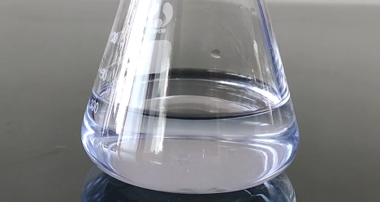

# 摇一摇就会变色的瓶子

## 实验方法：

1、250ml容器内 加入 2g氢氧化钠 ，并加少量水溶解。

Note：碱用量越大，褪色过程越快。

2、再加入2g葡萄糖。并加少量水溶解。

3、微量的 亚甲基蓝粉末。并加少量水溶解。（当作氧化还原指示剂用，过多影响变色敏感度）

4、充分震荡，溶液变蓝。

5、加点酚酞：

## 实验原理：

亚甲基蓝（蓝色）在碱性条件下被葡萄糖还原为还原态亚甲基蓝（无色），在振荡时氧气又将还原态亚甲基蓝氧化为亚甲基蓝。 

碱性条件下，葡萄糖构型由半缩醛变为开链醛，具备还原性。然后去还原亚甲基蓝。葡萄糖自身被氧化称葡萄糖酸。又因为碱性环境，生成葡萄糖酸钠。

## Note：

亚甲基蓝作为氧化还原指示剂不应加入过多，适当增大碱的用量可以缩短褪色周期，但也不能加入过多，否则会加快葡萄糖的失效。

变色反应的最佳温度是25℃，冬天可以略微加热。

加入其他染色剂可以改变氧化态和还原态呈现的颜色。 

实验中葡萄糖会被消耗，若振荡次数过多或溶液放置时间过长都将使溶液失效，溶液就会呈现亮黄色。