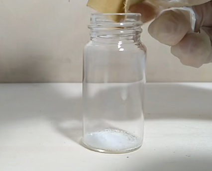
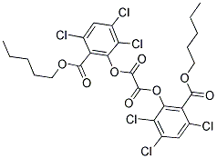
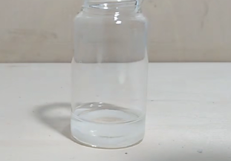
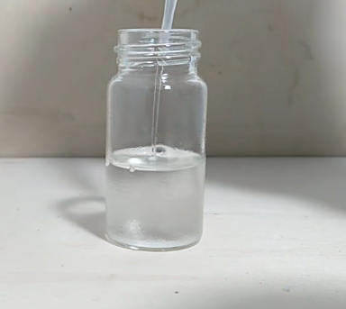
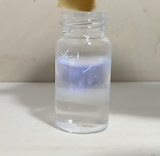
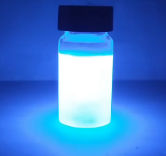

# 教你制作一根荧光棒！

## 实验步骤：

1、小玻璃瓶一个

​	加入 荧光颜料：双苯基蒽

​	一丢丢，就是字面意思

​	Note：不同染料，色儿不同~ 罗丹明B为橘红色。。。

2、再加入，双草酸酯（CPPO是一类化学物质）

​	质量： 1g

​	Note：双（2,4,5，三氯水杨酸正戊酯）草酸酯，双（2，4，5三氯水杨酸异戊酯）草酸酯，双（2，4，5三氯水杨酸正丁酯）草酸酯 等物质的简称。

​	Note：实验用的CPPO可以选择自制也可以选择网上购买，不过两个方法成本都高，荧光剂的选择还是罗丹明B比较便宜，双苯蒽可以自制也可以购买

3、加入 乙酸乙酯 EA（一种溶剂），震荡使溶解。

​		加量大概到半瓶就行。。。吧

​	Note：此溶剂对实验影响：大约四小时后熄灭。

4、上一步很重要，一定要先溶解完全

5、加入过氧化氢（30%双氧水）

​	Note： 过氧化氢喝乙酸乙酯 体积比 1：1 ，就按各10ml吧~

6、乙酸钠 （或者 水杨酸钠）

​	质量：0.3g

​	这玩意是催化剂~

​	看看，效果立马来了

7、封盖，晃悠~

​	Note：这个蓝色，是颜料的色，可以自己换。

## Note：

一些试剂需要去西安的化工店去买。。。网购不一定搞得到

## 总结：

拉倒吧~